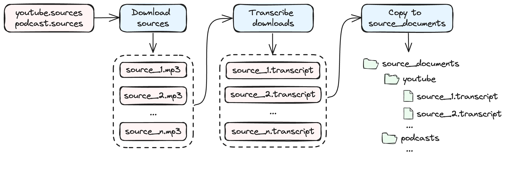
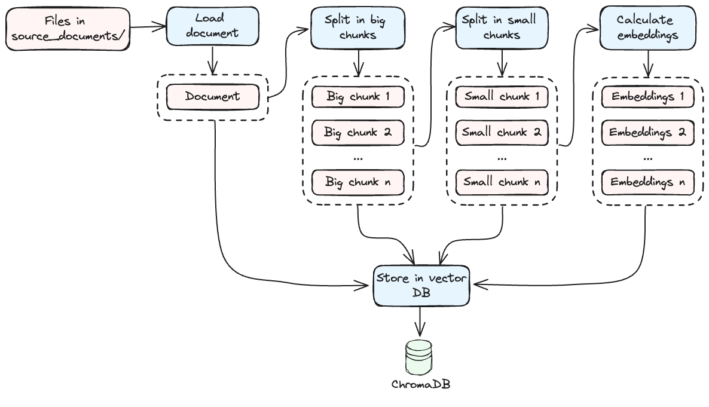
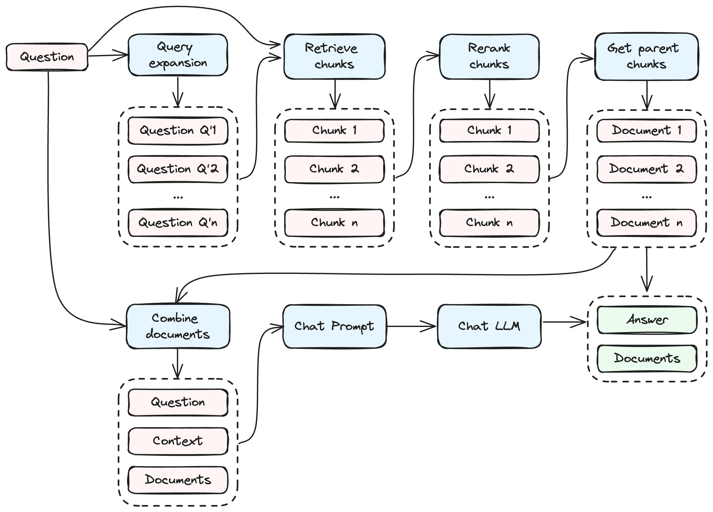

# [ChatNerds](https://github.com/raulonlab/chatnerds)

Yet another CLI tool to Q&A with your documents, also including YouTube videos and podcasts, using local LLMs and RAG (Retrieval-augmented generation) techniques. This is my personal project to learn about LLM and RAG

## Introduction

Chatnerds allows you to create and manage "nerds", each one with its own configuration and set of documents. The idea of a nerd is to be an expert in a specific subject. You can create as many nerd as you want, but can only work with one at a time.

## How to install?

- Requires python >=3.10
- Create an environment (recommended)
- Install package and CLI app:
```bash
pip install git+https://github.com/raulonlab/chatnerds.git
```

Or clone the repo and install it in development mode using poetry:
```bash
git clone https://github.com/raulonlab/chatnerds.git
poetry install
poetry shell
```

## How to Use?

```bash
chatnerds --help
```

```
Usage: chatnerds [OPTIONS] COMMAND [ARGS]...

╭─ Options ───────────────────────────────────────────────────────────────────────╮
│ --install-completion          Install completion for the current shell.         │
│ --show-completion             Show completion for the current shell, to copy it │
│                               or customize the installation.                    │
│ --help                        Show this message and exit.                       │
╰─────────────────────────────────────────────────────────────────────────────────╯
╭─ Commands ──────────────────────────────────────────────────────────────────────╮
│ init                  Initialize a new nerd. A nerd is a collection of sources  │
│                       and documents                                             │
│ remove                Remove an existing nerd                                   │
│ rename                Rename an existing nerd                                   │
│ activate              Activate a nerd. All subsequent commands like chat,       │
│                       study, etc. will use the active nerd's sources and        │
│                       documents.                                                │
│ list                  List all available nerds                                  │
│ download-sources      Download audio files (.mp3) of youtube and podcast        │
│                       sources                                                   │
│ transcribe-downloads  Transcribe downloaded audio files into transcript files   │
│                       (.transcript)                                             │
│ study                 Start studying (ingesting) the source documents and save  │
│                       the embeddings in the local DB                            │
│ chat                  Start an interactive chat session with your active nerd   │
│ review                Append a review value to the last chat log                │
│ env                   Print the current value of environment variables          │
│ config                Print the active nerd configuration (config.yml)          │
│ tools                 Other tools                                               │
│ db                    Other commands related with the local DB                  │
╰─────────────────────────────────────────────────────────────────────────────────╯

```

### Create and manage nerds

Create a new nerd:
```bash
chatnerds init nerd_name
```
> The first time, it will create a new directory `nerds` in the current path to store the nerds data.

The following files will be created in the nerds folder:

```
📁 nerds/
├─ 📁 nerd_name/
│  ├─ 📁 downloads/          // <-- audios downloaded from youtube and podcasts
│  ├─ 📁 source_documents/   // <-- source documents to ingest (pdf, txt, etc)
│  ├─ 📄 config.yml          // <-- LLM and RAG configuration of the nerd
│  ├─ 📄 podcast.sources     // <-- source podcast URLs (XML feed)
│  ├─ 📄 youtube.sources     // <-- source youtube URLs (channel, playlist or video)
```

Activate a nerd:
```bash
chatnerds activate nerd_name
```

This writes the environment variable `ACTIVE_NERD=nerd_name` in the file `.chatnerds.env` which is loaded by the application when it runs. 

You can also `list`, `rename` and `remove` nerds.

### Add sources

Nerds can ingest information from these 3 sources:

- **Document files in the directory `source_documents/`**. The supported formats with the loader class (from Langchain) used are the following:
  - `".pdf"`: PDFMinerLoader,
  - `".epub"`: UnstructuredEPubLoader,
  - `".md"`: UnstructuredMarkdownLoader,
  - `".txt"`: TextLoader,
  - `".doc"`: UnstructuredWordDocumentLoader,
  - `".docx"`: UnstructuredWordDocumentLoader,
  - `".enex"`: EverNoteLoader,
  - `".csv"`: CSVLoader,
  - `".html"`: UnstructuredHTMLLoader,
  - `".odt"`: UnstructuredODTLoader,
  - `".ppt"`: UnstructuredPowerPointLoader,
  - `".pptx"`: UnstructuredPowerPointLoader,

- **Youtube URLs in the file `youtube.sources`**: Links to videos, playlists and channels are supported. One url per line. Lines starting with `#` are ignored.
- **Podcast URLs in the file `podcast.sources`**: Links to XML feeds are supported. One url per line. Lines starting with `#` are ignored.

For the Youtube and podcast sources it's necessary to download the audio and transcribe the audio into text files in order to be ready to ingest.

### Download and transcribe Youtube and podcast sources



Start downloading the audio files (.mp3) of the youtube and podcast sources:
```bash
chatnerds download-sources
```
> Audio files are saved in `downloads/youtube/` and `downloads/podcasts/` organised by channel / author name

Start transcribing the audio files from the downloads directory into transcript files (.transcript):
```bash
chatnerds transcribe-downloads
```
> Transcript files are saved in `source_documents/youtube/` and `source_documents/podcasts/` with the same directory structure than audio files in the downloads directory

### Study documents



Start studying (also known as ingesting) the documents located in `source_documents/` and save the data in the vector DB:

```bash
chatnerds study
```
> Processed documents are stored in a Chroma vector database whose data files are placed in a subdirectory `db` of the nerd directory. The first time using a new sentence transformer model, it will download the model files and might take a while

For each document, the study process does the following steps:
- Load the document using a Langchain loader
- Split the document in big chunks and small chunks. Small chunks are used for retrieval / similarity searches. Big chunks (or parent chunks) are the ones included as a context in the prompt sent to the LLM
- Calculate the embeddings of the chunks using the sentence transformer model
- Store the document, big chunks, small chunks and embeddings in the local DB

Documents already processed and stored in the database are skipped

For the embedding calculations, it uses the Langchain classes HuggingFaceInstructEmbeddings or HuggingFaceEmbeddings. The model can be set up in the config.yml file of the nerd. The default model is `hkunlp/instructor-large`

### Chat



Start chatting with your active nerd in interactive mode:
```bash
chatnerds chat
```

or send the question straight away:
```bash
chatnerds chat "..."
```

> The first time using a new LLM model, it will download the model files and might take a while

The LLM used for completion can be set in the `config.yml` of the nerd. See more details about the nerd config in next sections. The default model is `mistral01_gguf`:
```
mistral01_gguf:
  provider: llamacpp
  prompt_type: mistral
  model_id: TheBloke/Mistral-7B-Instruct-v0.1-GGUF
  model_basename: mistral-7b-instruct-v0.1.Q4_K_M.gguf
  temperature: 0.2
  max_tokens: 8192
  n_batch: 1024  # 512 (Default: 8) set this based on your GPU & CPU RAM
  n_gpu_layers: -1
```

The model provider (aka model loader) can be set with the property `provider`. These are the available providers:
- `provider: llamacpp`: (Default if not present) HuggingFace model with `LlamaCpp`
- `provider: ollama`: Ollama server
- `provider: openai`: OpenAI server (base_url is configurable in order to use other APIs with the same interface than OpenAI)

> All the properties defined in the model will be sent to the provider class (temperature, max_tokens, etc)

The prompt can also be formated depending on the model architectures with the property `prompt_type`. These are the available prompt types:
- `prompt_type: llama`: Specific Llama prompt syntax. Use it with provider `llamacpp` and a llama/llama2 type model
- `prompt_type: mistral`: Specific Mistral prompt syntax. Use it with provider `llamacpp` and a mistral type model
- `prompt_type: None` (or not set): No formatting is applied to the prompt. Use it with provider `ollama` and `openai`

### Nerd configuration

Print the active nerd configuration:
```bash
chatnerds config
```

The file `config.yml` in the nerd directory allows to override the default model settings used by the nerd. See the default configuration (with annotations) in [chatnerds/config.yml](chatnerds/config.yml). The new configuration is applied on every command. 

> Note that changing some of the configuration, like `embeddings` and `chroma`, will invalidate the current embeddings added in the database. To fix it, delete the directory `./nerds/nerd_name/db` and start again

## Configuration with environment variables

The general behaviour of the application can be configured with environment variables or reading them from a `.env` file in the current path (optional). 

Print the current value of environment variables:
```bash
chatnerds env
```

Or print the default value of environment variables defined initially by the application (it will be the same than the current values if no .env file present)
```bash
chatnerds env --default
```

The available variables with their default values are:

```bash
LOG_FILE_LEVEL=NOTSET  # (Default: NOTSET) Logging level for the log file. Values: INFO, WARNING, ERROR, CRITICAL, NOTSET. If None, disable logging to file
LOG_FILE_PATH=logs/chatnerds.log  # (Default: "logs/chatnerds.log") Path to log file
VERBOSE=1  # (Default: 1) Amount of logs written to stdout (0: none, 1: medium, 2: full)

# transcription (Whisper) options
WHISPER_TRANSCRIPTION_MODEL_NAME=base  # (Default: "base") Name of the model to use for transcribing audios: tiny, base, small, medium, large
TRANSCRIPT_ADD_SUMMARY=False  # (Default: False) Include a summary of the transcription in the output file

# youtube download options
YOUTUBE_GROUP_BY_AUTHOR=True  # (Default: True) Group downloaded videos by channel
YOUTUBE_SLEEP_SECONDS_BETWEEN_DOWNLOADS=3  # (Default: 3) Number of seconds to sleep between downloads
YOUTUBE_ADD_DATE_PREFIX=True  # (Default: True) Prefix all episodes with an ISO8602 formatted date of when they were published. Useful to ensure chronological ordering
YOUTUBE_SLUGIFY_PATHS=True  # (Default: True) Clean all folders and filename of potentially weird characters that might cause trouble with one or another target filesystem
YOUTUBE_MAXIMUM_EPISODE_COUNT=30  # (Default: 30) Only download the given number of episodes per youtube channel. Useful if you don't really need the entire backlog. Set 0 to disable limit

# podcast download options
PODCAST_UPDATE_ARCHIVE=True  # (Default: True) Force the archiver to only update the feeds with newly added episodes. As soon as the first old episode found in the download directory, further downloading is interrupted
PODCAST_ADD_DATE_PREFIX=True  # (Default: True) Prefix all episodes with an ISO8602 formatted date of when they were published. Useful to ensure chronological ordering
PODCAST_SLUGIFY_PATHS=True  # (Default: True) Clean all folders and filename of potentially weird characters that might cause trouble with one or another target filesystem
PODCAST_GROUP_BY_AUTHOR=True  # (Default: True) Create a subdirectory for each feed (named with their titles) and put the episodes in there
PODCAST_MAXIMUM_EPISODE_COUNT=30  # (Default: 30) Only download the given number of episodes per podcast feed. Useful if you don't really need the entire backlog. Set 0 to disable limit
PODCAST_SHOW_PROGRESS_BAR=True  # (Default: True) Show a progress bar while downloading
```

The application also saves certain runtime settings in the file `.chatnerds.env` (for example, the active nerd). It's not necessary to touch this file since is handled automatically by the application.

## License

MIT
