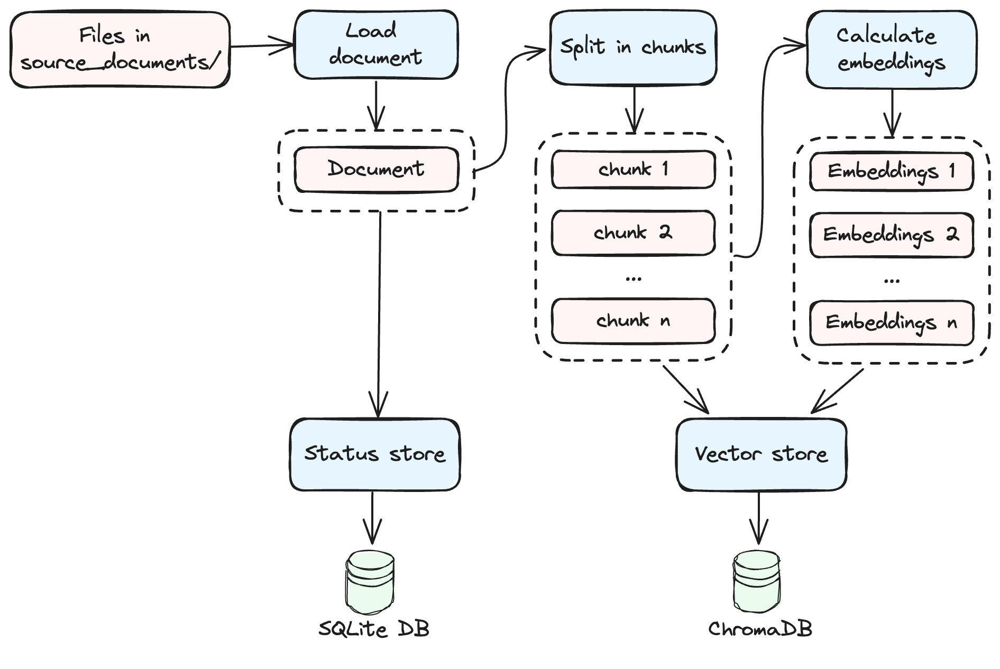

# [ChatNerds](https://github.com/raulonlab/chatnerds)

Yet another CLI tool to Q&A with your documents, also including YouTube videos and podcasts, using local LLMs and RAG (Retrieval-augmented generation) techniques. This is my personal project to learn about LLMs and RAGs.

## Introduction

Welcome to Chatnerds, a command-line interface (CLI) application to interact with private documents, YouTube videos, and podcasts using local language models (LLMs) and retrieval-augmented generation (RAG) techniques. The application allows you to create and interact with "nerds", each designed as an expert in a particular area of knowledge, with its own configuration and set of documents.

You can create multiple nerds to cover a wide range of topics and activate one at a time to talk about that specific area. 

## How to install?

- Requires python >=3.10
- Create an environment (recommended)
- Install package and CLI app:
```bash
pip install git+https://github.com/raulonlab/chatnerds.git
```

Or clone the repo and install it in development mode using poetry:
```bash
git clone https://github.com/raulonlab/chatnerds.git
poetry install
poetry shell
```

## How to Use?

```bash
chatnerds --help
```

```
 Usage: chatnerds [OPTIONS] COMMAND [ARGS]...

╭─ Options ─────────────────────────────────────────────────────────────────────────╮
│ --install-completion          Install completion for the current shell.           │
│ --show-completion             Show completion for the current shell, to copy it   │
│                               or customize the installation.                      │
│ --help                        Show this message and exit.                         │
╰───────────────────────────────────────────────────────────────────────────────────╯
╭─ Commands ────────────────────────────────────────────────────────────────────────╮
│ init                  Create and initialize a new nerd with the given name        │
│ remove                Remove an existing nerd                                     │
│ rename                Rename an existing nerd                                     │
│ activate              Activate a nerd. All subsequent commands like chat, study,  │
│                       etc. will use the active nerd configuration and source      │
│                       documents.                                                  │
│ list                  List all available nerds                                    │
│ download-sources      Download audio files (.mp3) of youtube and podcast sources  │
│ transcribe-downloads  Transcribe downloaded audio files into transcript files     │
│                       (.transcript) and copy them to 'source_documents' directory │
│ study                 Start studying documents in 'source_documents' directory    │
│                       (embed and store documents in vector DB)                    │
│ chat                  Start a chat session with your active nerd                  │
│ retrieve              Retrieve relevant documents of a query and optionally       │
│                       generate a summary of the documents.                        │
│ review                Append a review value to the last chat log                  │
│ env                   Print the current value of environment variables            │
│ config                Print the active nerd configuration (config.yml)            │
│ tools                 Miscellaneous tools                                         │
│ db                    View and manage the local DBs                               │
╰───────────────────────────────────────────────────────────────────────────────────╯

```

### Create and manage nerds

Create a new nerd:
```bash
chatnerds init nerd_name
```
> The first time, it will create a new directory `nerds` in the current path to store the nerds data.

The following files will be created in the nerds folder:

```
📁 nerds/
├─ 📁 nerd_name/
│  ├─ 📁 .nerd_store/        // <-- stores data files (status and vector DBs)
│  ├─ 📁 downloads/          // <-- audios downloaded from youtube and podcasts
│  ├─ 📁 source_documents/   // <-- source documents to ingest (pdf, txt, etc)
│  ├─ 📄 config.models.yml   // <-- Additional LLM presets
│  ├─ 📄 config.prompts.yml  // <-- Customized prompts
│  ├─ 📄 config.yml          // <-- Customized configuration
│  ├─ 📄 podcast.sources     // <-- source podcast URLs (XML feed)
│  ├─ 📄 youtube.sources     // <-- source youtube URLs (channel, playlist or video)
```

Activate a nerd:
```bash
chatnerds activate nerd_name
```

This writes the environment variable `ACTIVE_NERD=nerd_name` in the file `.chatnerds.env` which is loaded by the application when it runs. 

You can also `list`, `rename` and `remove` nerds.

### Add sources

Nerds can ingest information from these 3 sources:

- **Document files in the directory `source_documents/`**. The supported formats with the loader class (from Langchain) used are the following:
  - `".pdf"`: PDFMinerLoader,
  - `".epub"`: UnstructuredEPubLoader,
  - `".md"`: UnstructuredMarkdownLoader,
  - `".txt"`: TextLoader,
  - `".doc"`: UnstructuredWordDocumentLoader,
  - `".docx"`: UnstructuredWordDocumentLoader,
  - `".enex"`: EverNoteLoader,
  - `".csv"`: CSVLoader,
  - `".html"`: UnstructuredHTMLLoader,
  - `".odt"`: UnstructuredODTLoader,
  - `".ppt"`: UnstructuredPowerPointLoader,
  - `".pptx"`: UnstructuredPowerPointLoader,

- **Youtube URLs in the file `youtube.sources`**: Links to videos, playlists and channels are supported. One url per line. Lines starting with `#` are ignored.
- **Podcast URLs in the file `podcast.sources`**: Links to XML feeds are supported. One url per line. Lines starting with `#` are ignored.

For the Youtube and podcast sources it's necessary to download the audio and transcribe the audio into text files in order to be ready to ingest.

### Download and transcribe Youtube and podcast sources


Start downloading the audio files (.mp3) of the youtube and podcast sources:
```bash
chatnerds download-sources
```
> Audio files are saved in `downloads/youtube/` and `downloads/podcasts/` organised by channel / author name

Start transcribing the audio files from the downloads directory into transcript files (.transcript):
```bash
chatnerds transcribe-downloads
```
> Transcript files are saved in `source_documents/youtube/` and `source_documents/podcasts/` with the same directory structure than audio files in the downloads directory

### Study documents



Start ingesting the documents located in `source_documents/` (split, calculate embeddings and store in DBs):

```bash
chatnerds study
```
> The command processes documents by storing them in a vector database (either Chroma or Qdrant), with the database files located in the `.nerd_store/` subdirectory within the nerd's directory. Additionally, the necessary files for the sentence transformer model are automatically downloaded upon the first execution, which may require some time to complete.

For each document, the study process does the following steps:
- Load the document via a Langchain loader.
- Split the document into smaller chunks.
- Apply the sentence transformer model to generate embeddings of these chunks, which are used in the retrieval / similarity searches.
- Store both the chunks and their corresponding embeddings into the vector database.
- Store the original document within a local database called Status DB.

In subsequent runs, documents already processed are automatically excluded.

The embeddings model is loaded using Langchain's `HuggingFaceInstructEmbeddings` or `HuggingFaceEmbeddings` classes. The default model is `hkunlp/instructor-large` and can be changed in the `config.yml` file for the nerd. 

### Chat


Start an interactive chat session with your active nerd using the command line:
```bash
chatnerds chat
```

Alternatively, you can send a one-off question passing it as an argument:
```bash
chatnerds chat "..."
```
> Note: The first time you use a new LLM model, the necessary model files will be downloaded, which may take some time.

The LLM model for completions is configurable in the nerd's `config.yml` file (Further details are covered in subsequent sections). The default model is mistral-7b-instruct-v0.1-gguf:

```yaml
mistral-7b-instruct-v0.1-gguf:
  provider: llamacpp
  prompt_type: mistral
  model_id: TheBloke/Mistral-7B-Instruct-v0.1-GGUF
  model_basename: mistral-7b-instruct-v0.1.Q4_K_M.gguf
  temperature: 0.2
  # top_p: 0.95
  n_ctx: 16000
  max_tokens: 8192
  n_batch: 512  # Adjust based on your GPU & CPU RAM capacity (Default: 8)
  n_gpu_layers: -1
```

The `provider` property indicates the component that provides the model. Available providers include:
- `llamacpp`: (Default if not present) HuggingFace model using Langchain's `LlamaCpp` class (package `llama-cpp-python`)
- `ollama`: Ollama server using Langchain's `ChatOllama` or `Ollama` classes.
- `openai`: OpenAI server using Langchain's `ChatOpenAI` or `OpenAI` classes. The `base_url` can be set to point to APIs providing the same interface than OpenAI

> All defined properties (e.g., temperature, max_tokens) will be forwarded to the selected provider class.

The `prompt_type` property sets the formatting of the prompts according to the model's architecture, with available options being:

- `llama`: Specific Llama prompt syntax. Use it with provider `llamacpp` and a llama/llama2 type model
- `mistral`: Specific Mistral prompt syntax. Use it with provider `llamacpp` and a mistral type model
- `None` (or unset): No prompt formatting. Suitable for `ollama` and `openai` providers.

Finally, you can adjust the behaviour of the chain in the section `chat_chain` of the config file. Some of the parameters are:
- `n_expanded_questions`: Number of similar questions to expand the original query with. Set 0 to disable query expansion. (Default: 3)
- `use_cross_encoding_rerank`: Enable / disable cross-encoding reranking of retrieved documents. (Default: true)
- `n_combined_documents`: Number of documents to retrieve and to combine as a context in the chat prompt sent to the LLM. (Default: 6)

### Retrieve and summarize


If you only want to retrieve the most relevant documents related with a given query, run the command::
```bash
chatnerds retrieve
```

And optionally generate and display a summary of the retrieved documents:
```bash
chatnerds retrieve --summary
```

You can adjust the behaviour of the chain and the summary in the sections `retrieve_chain` and `summarize` of the config file. 

### Nerd configuration

Display the nerd's current configuration with the command:
```bash
chatnerds config
```

You can customize the behaviour of the nerd by editing the `config.yml` file in the nerd directory. The default settings used by the nerd are defined in [chatnerds/config.yml](chatnerds/config.yml). Changes to the configuration take effect immediately with each command execution.

> Important: Changes to certain settings, such as `embeddings` and `vector_store`, will invalidate the existing embeddings in the vector store. To address this, remove the `.nerd_store` directory and run `chatnerds study` again.

There exists 2 additional config files that can be customized:
- `config.models.yml`: Add custom model presets available to your nerd. See initial presets in [chatnerds/config.models.yml](https://github.com/raulonlab/chatnerds/blob/main/chatnerds/config.models.yml) or run `chatnerds config models` to see the complete list.
- `config.prompts.yml`: Change the prompts used by the nerd. See default prompts in [chatnerds/config.prompts.yml](https://github.com/raulonlab/chatnerds/blob/main/chatnerds/config.prompts.yml) or run `chatnerds config prompts` to see the active ones.

## Configuration with environment variables

You can adjust the application's general behavior using environment variables, either directly or by specifying them in an optional `.env` file located in the current directory.

To view the current set of environment variables, use the command:
```bash
chatnerds env
```

To display the default values as initially defined by the application (which will match the current values if no .env file is present), execute:
```bash
chatnerds env --default
```

The available variables with their default values are:

```ini
# general options
NERDS_DIRECTORY_PATH=nerds  # (Default: "nerds") Path to nerds directory
LOG_FILE_LEVEL=  # (Default: None) Logging level for the log file. Values: INFO, WARNING, ERROR, CRITICAL, NOTSET. If None, disable logging to file
LOG_FILE_PATH=logs/chatnerds.log  # (Default: "logs/chatnerds.log") Path to log file
VERBOSE=1  # (Default: 1) Amount of logs written to stdout (0: none, 1: medium, 2: full)

# transcription (Whisper) options
WHISPER_TRANSCRIPTION_MODEL_NAME=base  # (Default: "base") Name of the model to use for transcribing audios: tiny, base, small, medium, large
TRANSCRIPT_ADD_SUMMARY=False  # (Default: False) Include a summary of the transcription in the output file

# openai
OPENAI_API_KEY=  # (Default: None) OpenAI API key. If None, disable OpenAI integration

# youtube download options
YOUTUBE_GROUP_BY_AUTHOR=True  # (Default: True) Group downloaded videos by channel
YOUTUBE_SLEEP_SECONDS_BETWEEN_DOWNLOADS=3  # (Default: 3) Number of seconds to sleep between downloads
YOUTUBE_ADD_DATE_PREFIX=True  # (Default: True) Prefix all episodes with an ISO8602 formatted date of when they were published. Useful to ensure chronological ordering
YOUTUBE_SLUGIFY_PATHS=True  # (Default: True) Clean all folders and filename of potentially weird characters that might cause trouble with one or another target filesystem
YOUTUBE_MAXIMUM_EPISODE_COUNT=30  # (Default: 30) Only download the given number of episodes per youtube channel. Useful if you don't really need the entire backlog. Set 0 to disable limit

# podcast download options
PODCAST_UPDATE_ARCHIVE=True  # (Default: True) Force the archiver to only update the feeds with newly added episodes. As soon as the first old episode found in the download directory, further downloading is interrupted
PODCAST_ADD_DATE_PREFIX=True  # (Default: True) Prefix all episodes with an ISO8602 formatted date of when they were published. Useful to ensure chronological ordering
PODCAST_SLUGIFY_PATHS=True  # (Default: True) Clean all folders and filename of potentially weird characters that might cause trouble with one or another target filesystem
PODCAST_GROUP_BY_AUTHOR=True  # (Default: True) Create a subdirectory for each feed (named with their titles) and put the episodes in there
PODCAST_MAXIMUM_EPISODE_COUNT=30  # (Default: 30) Only download the given number of episodes per podcast feed. Useful if you don't really need the entire backlog. Set 0 to disable limit
PODCAST_SHOW_PROGRESS_BAR=True  # (Default: True) Show a progress bar while downloading
```

The application also stores runtime settings in the `.chatnerds.env` file, such as the active nerd configuration. It's not necessary to touch this file, as it is handled automatically by the application.

## License

This project is under the MIT License. For more details, see the LICENSE file.

